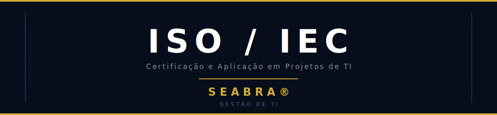

<p align="center">
  
</p>

<br/>

<p align="center">
  
  
  
  
</p>

---

## 📌 Sobre o Projeto

Este é um aplicativo mobile educacional desenvolvido por **SEABRA**, estudante de **Gestão de TI**, como projeto acadêmico para ensinar e repassar o conhecimento sobre as principais normas **ISO/IEC** e sua aplicação prática em projetos de Tecnologia da Informação.

O objetivo é criar um material de estudo interativo, organizado e acessível no celular, cobrindo os conceitos fundamentais de certificações internacionais que todo profissional de TI precisa conhecer.

---

## 🎯 Objetivos do Projeto

- Apresentar as principais normas ISO/IEC de forma clara e estruturada
- Conectar a teoria das normas com a aplicação real em projetos de TI
- Servir como material de revisão e consulta rápida para estudantes de Gestão de TI
- Demonstrar a construção de um app educacional com Expo e React Native

---

## 📚 Conteúdo Abordado

### Normas ISO/IEC Cobertas

| Norma | Área | Descrição |
|---|---|---|
| **ISO/IEC 27001** | Segurança da Informação | Sistema de Gestão de Segurança da Informação (SGSI) |
| **ISO/IEC 27002** | Controles de Segurança | Catálogo de controles práticos de segurança |
| **ISO/IEC 20000** | Gestão de Serviços | Sistema de Gestão de Serviços de TI (SGSTI) |
| **ISO 9001** | Qualidade | Gestão da Qualidade e melhoria contínua |
| **ISO/IEC 25010** | Qualidade de Software | Modelo de qualidade de produtos de software |
| **ISO/IEC 90003** | Engenharia de Software | Aplicação da ISO 9001 em desenvolvimento de software |
| **ISO/IEC 38500** | Governança de TI | Governança e princípios estratégicos de TI |

### Temas Complementares

- Diretrizes de Política de Segurança da Informação
- Gestão de Riscos (identificação, avaliação, mitigação, aceitação, transferência)
- Gestão de Incidentes (incidentes cibernéticos e de segurança)
- Conscientização e Capacitação em Segurança Cibernética
- Processo de certificação ISO (auditoria, fases, organismos certificadores)
- Benefícios das certificações para projetos de TI

---

## 🚀 Como Executar

### Pré-requisitos

- [Node.js](https://nodejs.org/) instalado na máquina
- [Expo Go](https://expo.dev/go) instalado no smartphone (Android ou iOS)
- Git instalado

### Instalação

1. Clone o repositório e instale as dependências:

   ```bash
   git clone https://github.com/Seabratex/expoApp.git
   cd expoApp
   npm install
   ```

2. Inicie o aplicativo:

   ```bash
   npx expo start
   ```

3. Se estiver em redes diferentes (celular e computador em redes distintas), use o túnel:

   ```bash
   npx expo start --tunnel
   ```

### Como abrir no celular

Após iniciar o app, um **QR Code** aparecerá no terminal. Abra o **Expo Go** no seu smartphone e escaneie o QR Code para abrir o app diretamente.

> Disponível em: **Android**, **iOS** e **Web (navegador)**

---

## 🗂️ Estrutura do Projeto

```
expoApp/
├── app/
│   ├── (tabs)/
│   │   ├── index.tsx       ← Tela principal: conteúdo ISO/IEC
│   │   └── explore.tsx     ← Aprofundamento: Diretrizes e Gestão
│   └── modal.tsx           ← Modal com roteiro do módulo
├── components/
│   └── BlocoAula.tsx       ← Componente reutilizável de conteúdo
├── assets/
│   └── images/
│       └── banner.svg      ← Banner do projeto
└── README.md
```

---

## 🔗 Referências

- [ISO/IEC 27001 — Information Security](https://www.iso.org/isoiec-27001-information-security.html)
- [ISO/IEC 20000 — IT Service Management](https://www.iso.org/standard/70636.html)
- [ISO 9001 — Quality Management](https://www.iso.org/iso-9001-quality-management.html)
- [ISO/IEC 38500 — IT Governance](https://www.iso.org/standard/62816.html)
- [ISO/IEC 25010 — Software Quality](https://www.iso.org/standard/35733.html)
- [Expo Documentation](https://docs.expo.dev/)

---

## ⚖️ Direitos Autorais

```
© 2025 SEABRA® — Gestão de TI
Todos os direitos reservados.

Este projeto foi desenvolvido para fins educacionais e acadêmicos.
É protegido por direitos autorais. Reprodução parcial ou total
sem autorização expressa do autor é proibida.

SEABRA® é uma marca do autor deste projeto.
```

---

<p align="center">
  Desenvolvido com 💛 por <strong>SEABRA</strong> — Gestão de TI
<